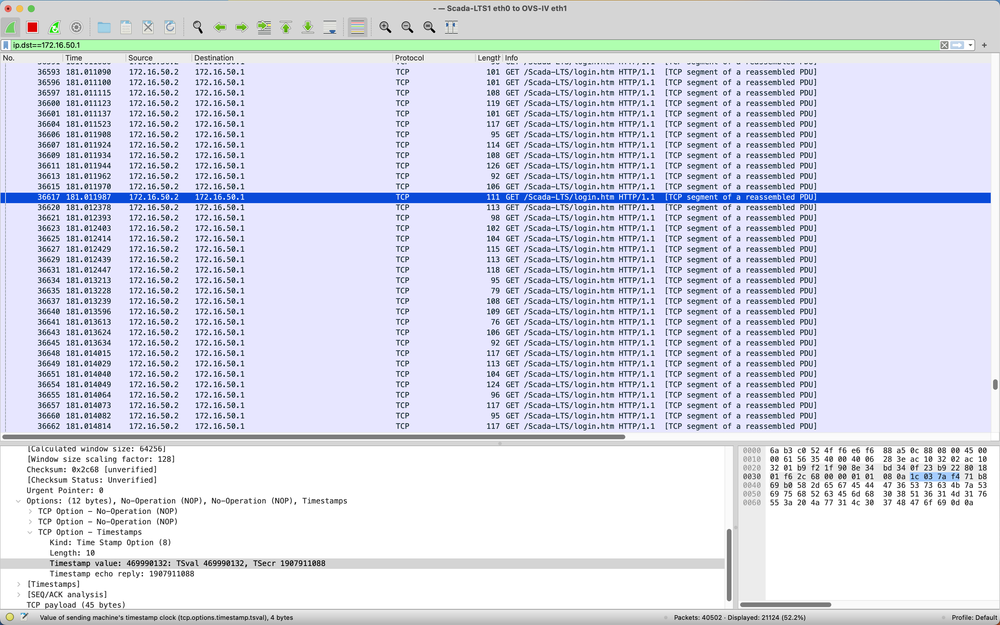
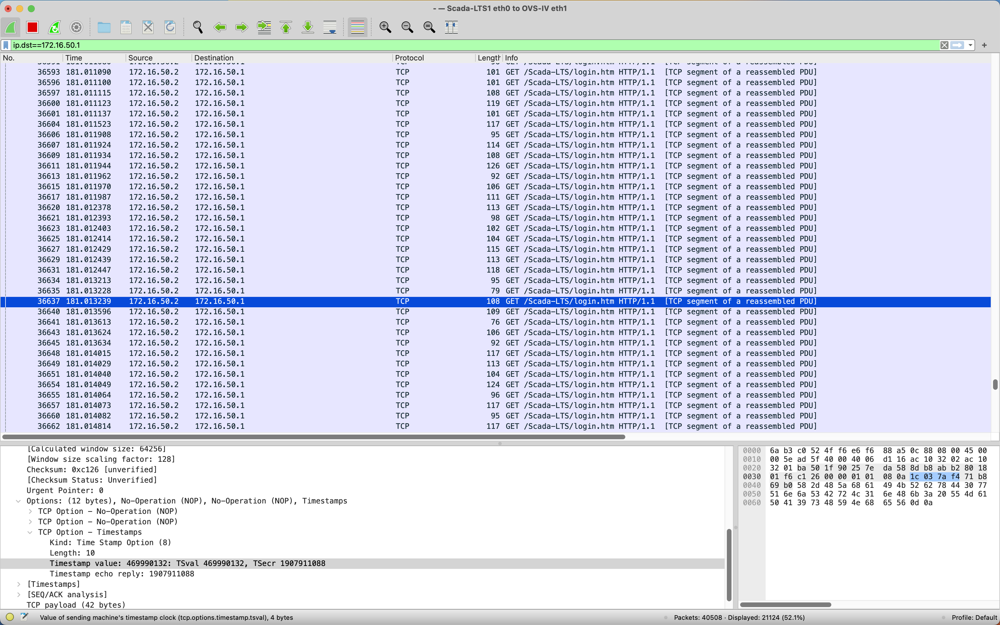

# Countermeasure against Slowloris on HTTP

The countermeasure is implemented as an app component in ONOS SDN controller, as shown in Figure 1.

- ONOS is written in pure Java. You should be able to use Java + Maven to programme the app component. If not, watch by yourself tutorials on YouTube or BiliBili on basic usage of Java + Maven in IntelliJ IDEA.
- An app component has listeners to listen for the state change of ONOS and take actions reactively.
  - A DeviceListener can identify newly added devices (Open vSwitches).
  - A PacketProcessor is called whenever ONOS receives a new packet from an Open vSwitch.
- An app component can call methods in services to query and edit ONOS configurations.
  - The methods in FlowObjectiveService and FlowRuleService can add or remove flow entries from Open vSwitches.
  - The methods in CoreService and ComponentConfigService are essential for the app component to be registered and configured upon activation.

<br/>


<p align="center"><b>Figure 1</b> ONOS Subsystem Structure</p>

<br/>

The countermeasure is based on the vulnerability of the Slowloris attack itself. From [Wireshark capture](../../network/ics/README.md#7-capture-the-traffic-using-wireshark), we find that multiple keep-alive headers sent by the attacker in one period have the same timestamp value.

<div align=center>




</div>

<br/>

```python
def slowloris_iteration():
    logging.info("Sending keep-alive headers...")
    logging.info("Socket count: %s", len(list_of_sockets))

    # Try to send a header line to each socket
    for s in list(list_of_sockets):
        try:
            s.send_header("X-a", random.randint(1, 5000))
        except socket.error:
            list_of_sockets.remove(s)
```

The code above from Slowloris attack is a python function to send keep-alive headers periodically to keep all established connections alive. In the `for` loop, all keep-alive headers are sent one by one. Since modern CPUs are very powerful, multiple `send_header()` functions are executed in 1 millisecond. Since TCP timestamp is measured in milliseconds, this results in dozens of TCP keep-alive packets with the same timestamp value. That's where our cuontermeasure focuses on.

<br/>


<p align="center"><b>Figure 2</b> HTTP Countermeasure Workflow</p>

<br/>

Figure 2 shows the mechanism of SDN-based countermeasure as an app component of ONOS against Slowloris on HTTP.

- `PacketProcessor` monitors all traffic through Open vSwitches and selects TCP packets with PSH+ACK flag that represent HTTP packets.
- `FreqAnalyzer` periodically analyses this packets to detect Slowloris attack based on timestamp. In 10s, if there are more than 5 TCP packets with the same timestamp from the same source IP, then the IP is considered an attacker and defence flow entries are deployed in all Open vSwitches to block it.

Refer to [this repo](https://github.com/wangziyao318/onos-app-ics/) for source code of the countermeasure.

We use OpenJDK11 + Maven in IntelliJ IDEA to programme the app component.

- Watch [this video](https://www.youtube.com/watch?v=D1sRK8JLCQ4) or others on YouTube to get started with Maven in IDEA.
- Chinese users watch [this series](https://www.bilibili.com/video/BV1Aa411M7fu/) or other videos on BiliBili to get started with Maven in IDEA.
- Refer to the [official document](https://www.jetbrains.com/help/idea/getting-started.html) on how to use IntelliJ IDEA.

Concerning JDKs, you can easily download them in "Project Structure" in IntelliJ IDEA, as shown in Figure 3. You needn't install it in advance.

The Maven bundled in IDEA is enough for use.

<br/>


<p align="center"><b>Figure 3</b> Download JDK in IDEA</p>
