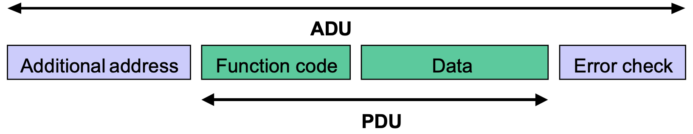

# Injection Attack on Modbus/TCP

- [Injection Attack on Modbus/TCP](#injection-attack-on-modbustcp)
	- [Modbus/TCP](#modbustcp)
	- [Injection Attack on OpenPLC via Modbus/TCP](#injection-attack-on-openplc-via-modbustcp)

## Modbus/TCP

Modbus/TCP is a type of Modbus protocol based on TCP (Transmission Control Protocol) that runs on Ethernet and uses TCP port `502`. More information is available [here](https://modbus.org/docs/Modbus_Messaging_Implementation_Guide_V1_0b.pdf).

Modbus is a Client-Server protocol designed for communications between ICSs (usually between PLC and SCADA HMI). Modbus defines its unique Protocol Data Unit (PDU) that runs on data link layer and is independent of the physical layer. Thereby, Modbus with identical PDU can be deployed on either Serial or Ethernet, with different Application Data Units (ADUs) that implements routing, error check, and other basic functions in different physical layers, as shown in Figure 1 and 2.

- That Modbus is a "Master-Slave" protocol is replaced by the word "Client-Server", [according to Modbus organisation](https://modbus.org/docs/Client-ServerPR-07-2020-final.docx.pdf).

A Modbus frame has 3 implementations: Modbus/RTU, Modbus/ASCII, and Modbus/TCP. The first two are general Modbus frames that operate on Serial, as shown in Figure 1. The Modbus/TCP frame runs on Ethernet, as shown in Figure 2. In our ICS network, we use Modbus/TCP for OpenPLC1 and Scada-LTS1 to communicate over Ethernet.

<br/>



<p align="center"><b>Figure 1</b> General Modbus Frame</p>


<p align="center"><b>Figure 2</b> Modbus/TCP Frame</p>

<br/>

In a Modbus/TCP frame, the function code is an 1-Byte binary with a range from 1 (00000001) to 255 (11111111). Some of the function codes of Modbus protocol are pre-defined (well-known). For example in OpenPLC, 1 means `Read Coils`, 3 means `Read Holding Registers`, and 6 means `Write Single Register`.

In a Modbus/TCP frame, the data is defined by the OpenPLC itself. For the same function code 6 `Write Single Register`, specified data tells OpenPLC to write to specified register with specified value.

Modbus/TCP frames are transferred in plaintext, which is vulnerable to interception, modification, and fabrication.

## Injection Attack on OpenPLC via Modbus/TCP

We first capture the Modbus/TCP frames that go in and out the OpenPLC using Wireshark. This is to examine the different function codes and data defined by the OpenPLC for different purposes. For function code 6 `Write Single Register`, we notice from Figure 3 that reference number 4 data 0001 means set `mode_register` to `manual`, and from Figure 4 that reference number 5 data 0001 means manually power `on` the `heater`. So, if we continue to send [6 4 0001] and then [6 5 0001] Modbus/TCP frames to OpenPLC, then the OpenPLC should always be in manually on mode. This is a type of injection attack.

<br/>


<p align="center"><b>Figure 3</b> Function Code 6 Reference Number 4 Data 0001</p>


<p align="center"><b>Figure 4</b> Function Code 6 Reference Number 5 Data 0001</p>

<br/>


<p align="center"><b>Figure 5</b> Injection Attack on Modbus/TCP</p>

<br/>

Figure 5 shows a successful injection attack. Refer to the [source code](https://github.com/thiagoralves/defcon26/blob/master/Water%20Heater%20Experiment/Injection_Attack/) of the attack written in C++.

```sh
# compile the attacker
# "g++" is bundled in "build-essential" in APT packet manager, run "apt install build-essential" to install the compiler in Ubuntu if you don't have one
g++ injection_attack.cpp -o injection_attack -pthread

# run the attacker
# host ip: IP of OpenPLC the victim
# frequency: measured in Hz, default is 1000
./injection_attack -h [host ip] -f [frequency of the messages]
```

The Modbus/TCP attacker has been integrated into our KaliLinux Docker image. The attacker is added to the system path `/usr/bin/`.
