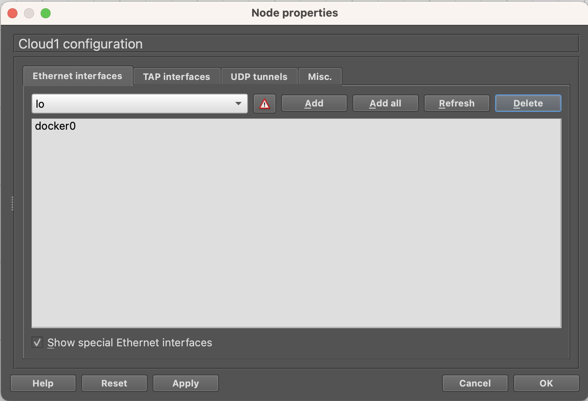

# Instantiate and Configure Nodes

- [Instantiate and Configure Nodes](#instantiate-and-configure-nodes)
	- [Instantiate Nodes](#instantiate-nodes)
		- [Rename a Node](#rename-a-node)
		- [Configure Network Adapters](#configure-network-adapters)
		- [Link Nodes](#link-nodes)
	- [Configure Nodes](#configure-nodes)

The word "instantiate" is a Java-style expression to `new` an object from a given class. In GNS3 server, it describes the action to create a node from a given appliance.

## Instantiate Nodes

We map new nodes to additional appliances in the ICS network.

- We delete PC1 ~ PC3, and [rename](#rename-a-node) PC4 to PC1.
- Kali Linux is a fork of Ubuntu, with the same APT package manager.

| Nodes | Appliances |
| --- | --- |
| OpenPLC1 | OpenPLC |
| Scada-LTS1 | Scada-LTS |
| KaliLinux1 & 2 | KaliLinux |
| OVS-I - IV | Open vSwitch management |
| Cloud1 - 4 | Cloud |


1. Instantiate new nodes by dragging additional appliances from the left sidebar to workspace according to the figure and table above.
2. Right click on a node and select `Delete` to delete it.
3. [Rename these nodes](#rename-a-node) according to the figure above.
4. [Configure network adapters](#configure-network-adapters) for these nodes.
5. [Link these nodes](#link-nodes) according to the figure above.

### Rename a Node

[Refer to this section](../../base/nodes/README.md#rename-a-node)

### Configure Network Adapters

This applies to OpenPLC1, Scada-LTS1, KaliLinux1 ~ KaliLinux2, OVS-I ~ OVS-IV, and Cloud1 ~ Cloud4. In principle, all VPCS nodes and Docker containers need configuring.

We first configure all docker containers: OpenPLC1, Scada-LTS1, KaliLinux1 ~ KaliLinux2, and OVS-I ~ OVS-IV. They share the same configuration process.

<div align=center>


</div>

<br/>

Take OpenPLC1 as an example.

1. Right click on the device and select `Edit config`.
2. Replace all content in it with the configuration below, and then `Save` it.

```
auto eth0
iface eth0 inet static
	address 192.168.10.1
	netmask 255.255.255.0
	gateway 192.168.10.254
	up echo nameserver 8.8.8.8 > /etc/resolv.conf
```

Now, we can configure network adapters for other docker containers according to the information below.

- Scada-LTS1

```
auto eth0
iface eth0 inet static
	address 172.16.50.1
	netmask 255.255.255.0
	gateway 172.16.50.254
	up echo nameserver 8.8.8.8 > /etc/resolv.conf
```

- KaliLinux1

```
auto eth0
iface eth0 inet static
	address 192.168.40.1
	netmask 255.255.255.0
	gateway 192.168.40.254
	up echo nameserver 8.8.8.8 > /etc/resolv.conf
```

- KaliLinux2

```
auto eth0
iface eth0 inet static
	address 172.16.50.2
	netmask 255.255.255.0
	gateway 172.16.50.254
	up echo nameserver 8.8.8.8 > /etc/resolv.conf
```

- OVS-I

```
auto eth0
iface eth0 inet static
	address 172.17.1.1
	netmask 255.255.0.0
	gateway 172.17.0.1
	up echo nameserver 8.8.8.8 > /etc/resolv.conf
```

- OVS-II

```
auto eth0
iface eth0 inet static
	address 172.17.1.2
	netmask 255.255.0.0
	gateway 172.17.0.1
	up echo nameserver 8.8.8.8 > /etc/resolv.conf
```

- OVS-III

```
auto eth0
iface eth0 inet static
	address 172.17.1.3
	netmask 255.255.0.0
	gateway 172.17.0.1
	up echo nameserver 8.8.8.8 > /etc/resolv.conf
```

- OVS-IV

```
auto eth0
iface eth0 inet static
	address 172.17.1.4
	netmask 255.255.0.0
	gateway 172.17.0.1
	up echo nameserver 8.8.8.8 > /etc/resolv.conf
```

We then configure all Cloud nodes: Cloud1 ~ Cloud4.

1. Right click on a Cloud node and select `Configure` to open its configuration panel.
2. Check "`Show special Ethernet interfaces`", and then in the dropdown menu you can see the `docker0` network adapter.


3. Select `docker0` and click `Add` to add this adapter to the Cloud node. You may safely `Delete` other network adapters such as `enp?s0` (the RJ45 Ethernet port in your home desktop) and `wol?` (the WiFi card in your home desktop), because we don't need them. Click `Apply` and `OK` to save your change.
   - Nodes in GNS3 server connected to `enp?s0` or `wol?` are exposed to the outside Local Area Network (LAN), which should be avoided for security. Use the `NAT` node instead if you only want the Internet connection.



### Link Nodes

[Refer to this section](../../base/nodes/README.md#link-nodes)

## Configure Nodes

Docker containers in GNS3 server are usually volatile. They are created from Docker images when you open the project, and destroyed when you close the project. However, docker images with volume mapping can keep the data persistent, see the [official document](https://docs.gns3.com/docs/emulators/docker-support-in-gns3#persistence).

KaliLinux1 & 2 and OVS-I - IV can be used out of the box, so no configuration is needed.

- [OpenPLC1](./OpenPLC1.md)
- [Scada-LTS1](./Scada-LTS1.md)
